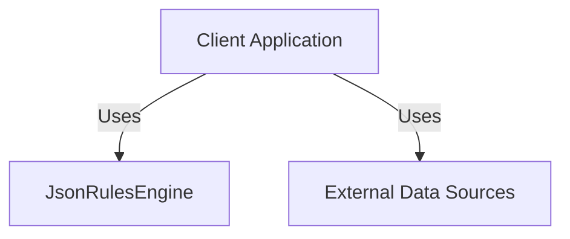
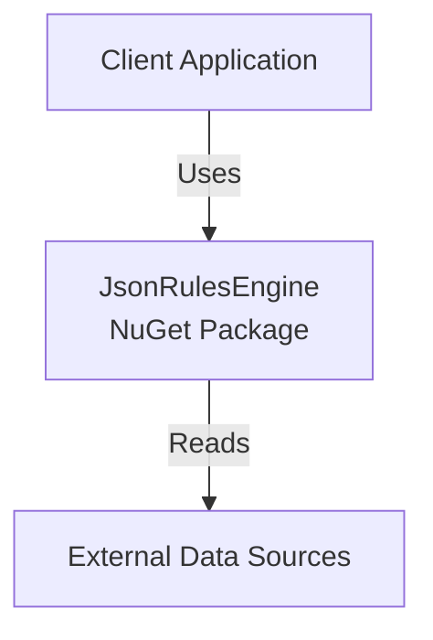
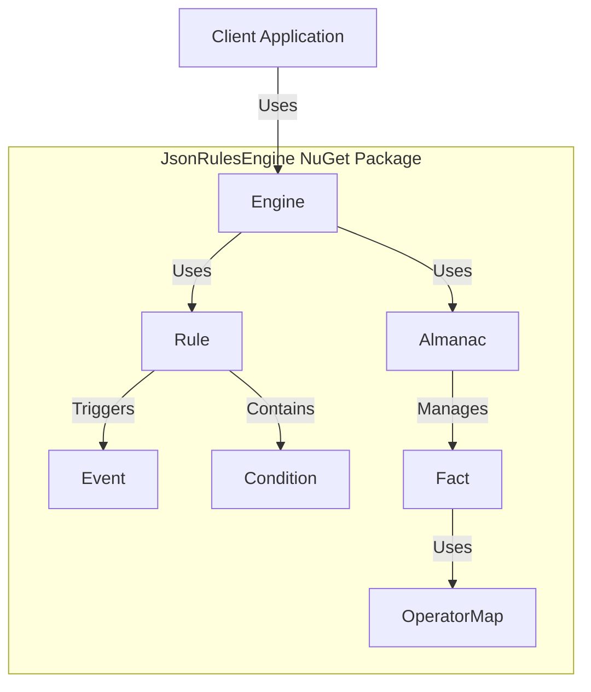
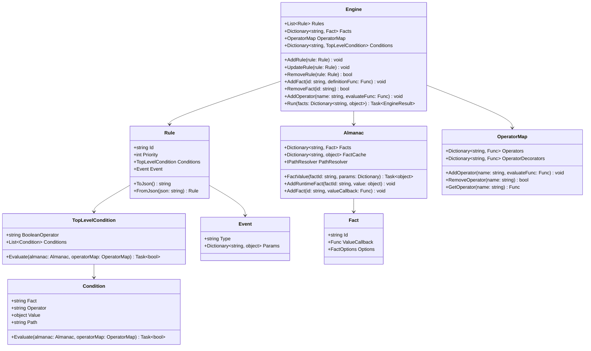

# C4 Model for JsonRulesEngine

This document provides a C4 model representation of the JsonRulesEngine architecture.

## Level 1: System Context Diagram

The JsonRulesEngine is used by client applications to evaluate business rules against data that may come from various sources, including external systems.

## Level 2: Container Diagram

The JsonRulesEngine is packaged as a NuGet package that can be integrated into .NET applications.

## Level 3: Component Diagram

## Level 4: Code Diagram

## Relationships

1. **Engine** manages multiple **Rules**, **Facts**, and **Operators**
2. **Rule** contains a **TopLevelCondition** and an **Event**
3. **TopLevelCondition** contains multiple **Conditions**
4. **Condition** references a **Fact** and an **Operator**
5. **Almanac** manages **Facts** and their values
6. **OperatorMap** manages **Operators** and **OperatorDecorators**

## Behavioral Aspects

1. Client applications create an **Engine** instance
2. Rules are added to the **Engine** via `AddRule()`
3. Facts are defined via `AddFact()`
4. When `Run()` is called:
   - The **Engine** creates an **Almanac** instance
   - Each **Rule** is evaluated based on its **Conditions**
   - **Facts** are retrieved or computed as needed
   - **Operators** compare fact values against condition values
   - If a rule's conditions are met, its **Event** is triggered
   - The **Engine** returns an **EngineResult** with all triggered events
